# Phân công & workflow — 4 người

> **Giả định lịch:** N1 = 30/07/2026, N2 = 31/07/2026 (khoá 4). Nếu lệch, mọi mốc dưới đây vẫn giữ nguyên thứ tự — chỉ dịch giờ.
>
> **Trạng thái xuất phát:** prototype Mock đã chạy (web UI + AI thật + trace). Còn thiếu/đang hoàn thiện `spec.md`, artifact eval do người phụ trách riêng cung cấp, `validation/`, README nhóm, `reflection/`, slide.

---

## Nguyên tắc chia việc

Chia theo **khối điểm rubric**, không chia theo "ai gõ nhiều chữ". Lý do: rubric chấm trên artifact, và **vibe-coding rule** — tại CP5 một thành viên ngẫu nhiên bị hỏi về phần có tên mình, không giải thích được thì phần đó **0 điểm**. Nên ai viết phần nào phải *hiểu* phần đó, không phải chỉ dán output AI vào.

| Người | Khối phụ trách | Điểm gánh |
|---|---|---|
| **Hồ Quang Minh - 2A202601906** · Evidence | R1 · `spec.md` §1-§2-§3 | **15** |
| **Nguyễn Minh Quang - 2A202601730** · Thiết kế | R2 + R3 · `spec.md` §4-§5-§6 | **26** |
| **Lệnh Quang Hưng - 2A202601546** · Repo glue + nhận artifact kiểm thử | R4 · `spec.md` §7 + kết quả eval từ người phụ trách riêng | **15** |
| **Lê Minh Đạt - 2A202601088** · Prototype & Demo | R5 + R6 + R7 · `validation/` + README + slide | **19** |

Cộng đúng 75. Reflection cá nhân mỗi người tự viết, chấm riêng.

---

## Timeline

```mermaid
gantt
    dateFormat HH:mm
    axisFormat %H:%M
    title Từ giờ tới CP6

    section Tối N1 — hạn cứng 23:59
    T1 · Evidence §1-§3         :a1, 17:00, 300m
    T2 · Thiết kế §4-§6         :a2, 17:00, 300m
    T3 · Golden set + pilot run :a3, 17:00, 240m
    T3 · Chốt quality bar       :crit, a4, after a3, 60m
    T4 · README + gom spec.md   :a5, 21:00, 180m

    section Sáng N2 — CP3 10:30
    T3 · Chạy trọn bộ + bảng %  :crit, b1, 08:00, 150m
    T4 · Chuẩn bị vòng user test:b2, 08:00, 150m

    section Trưa N2 — CP4 12:00
    Rà spec, vá chỗ thiếu       :c1, 10:30, 90m

    section Chiều N2 — CP5 14:00
    T4 · Validation 5 người     :crit, d1, 12:00, 90m
    T2 · Changelog từ feedback  :d2, after d1, 30m
    T4 · Slide + dry run        :d3, 12:00, 120m

    section CP6 15:00
    Demo                        :milestone, 15:00, 0m
```



**Hai nút thắt phải canh:**

1. **Quality bar chốt lúc 23:59 N1 và không đổi được nữa.** Người phụ trách eval phải chạy thử một lượt trước khi đặt bar; Lệnh Quang Hưng - 2A202601546 nhận kết quả để ghép vào tài liệu.
2. **Validation cần 5 người ngoài nhóm.** Phải hẹn trước từ tối N1, đừng đợi tới 12:00 N2 mới đi tìm người.

---

## Hồ Quang Minh - 2A202601906 · Evidence & Impact — 15 điểm

**Sản phẩm:** `spec.md` §1 · §2 · §3

Mining log đã xong rồi ([evidence/mining/](evidence/mining/)) — việc của bạn là **biến số thành lập luận**, không phải chạy lại script.

| Việc | Rubric | Ghi chú |
|---|---|---|
| Job executor + workflow, Core JTBD (không có tên sản phẩm/AI trong câu) | R1 · 3đ | Dùng [worksheet JTBD](tham-khao/worksheet-jtbd-day-du.md) |
| Problem statement — **không được có chữ AI** | R1 · 3đ | Ai · đang làm gì · vướng đâu · **hậu quả gì** |
| Dán số từ MINING-LOG + ≥5 quote nguyên văn có mã `M####` | R1 · 6đ | Đã có sẵn 10 ví dụ, chỉ cần chọn |
| **Bảng impact ≥3 ứng viên** có số: bao nhiêu người × tần suất × tốn gì mỗi lần | R1 · 3đ | ⚠️ chưa ai làm |
| **Ứng viên đã LOẠI + lý do bằng số** | R1 · 3đ | ⚠️ chưa ai làm — rubric hỏi thẳng |
| §3 · 2 sản phẩm tương tự: flow / đáng học / đáng né / mình khác gì | — | Stack Overflow "similar questions", Discord Search |

**Con số mạnh nhất đang bị chôn:** *46,2% câu trả lời của tutor có `citations` rỗng*. Nó dẫn thẳng vào luật "không có nguồn thì không được trả lời" — đưa lên đầu §1.

**CP5 sẽ hỏi bạn:** ngưỡng Jaccard 0.60 lấy đâu ra, đổi thành 0.5 thì số thay đổi thế nào. Đọc kỹ [MINING-LOG §Phương pháp đếm](evidence/mining/MINING-LOG.md).

---

## Nguyễn Minh Quang - 2A202601730 · Lát cắt & Chỗ khó — 26 điểm

**Sản phẩm:** `spec.md` §4 · §4b · §5 · §6 — **khối điểm to nhất**

| Việc | Rubric |
|---|---|
| Lát cắt MỘT CÂU (1 user · 1 việc · 1 quyết định AI · 1 kết quả), khớp bản build | R2 · 3đ |
| ≥3 non-goals, bản build không được vi phạm | R2 · 2đ |
| Automation: augment / conditional / automate + lý do theo **cost-of-error** | R2 · 4đ |
| **≥4 nguyên tắc HAX/PAIR, mỗi cái trỏ vào chỗ CỤ THỂ trong prototype** | R2 · **6đ** |
| 4 lớp chỗ khó ①②③④, cụ thể — không chung chung | R3 · 4đ |
| **≥8 kịch bản** có hành vi mong muốn, phủ đủ 4 lớp | R3 · 4đ |
| 4 đường đi: happy / low-confidence / failure / correction | R3 · 3đ |

Ô 6 điểm là ô dễ ăn nhất mà hay bị bỏ, vì codebase **đã có sẵn** chỗ để trỏ:

| Nguyên tắc | Trỏ vào đâu |
|---|---|
| Làm rõ hệ thống làm được gì | 4 badge quyết định trong UI + `LABELS` |
| Cho thấy vì sao hệ thống làm vậy | trường `why` trong mỗi source + panel Trace |
| Truyền đạt độ chắc chắn | `confidence` + badge `resolution` từng nguồn |
| Hỗ trợ sửa sai hiệu quả | `create_new_post` luôn kèm `draft_post` để người dùng sửa tiếp |
| Thất bại một cách an toàn | `normalize_output` xoá nguồn bịa + hiện `warnings` |

Bảng ánh xạ 4 lớp chỗ khó đã có sẵn ở [PROJECT-OVERVIEW.md §8](PROJECT-OVERVIEW.md) — dùng làm khung, viết dày thêm.

**CP5 sẽ hỏi bạn:** vì sao tách 2 tool thay vì gộp 1. Câu trả lời ở [tools.py:3-9](codebase/tools.py#L3-L9).

---

## Lệnh Quang Hưng - 2A202601546 · Repo glue + nhận artifact kiểm thử — 15 điểm

**Sản phẩm:** `spec.md` §7 + artifact eval do người phụ trách riêng gửi lại.

| Việc | Rubric |
|---|---|
| Nhận golden set ≥20 case từ người phụ trách eval và kiểm tra có được trỏ trong spec | R4 · 4đ |
| Mỗi chiều chất lượng có **định nghĩa kiểm chứng được** (người ngoài chấm ra cùng kết quả) | R4 · 4đ |
| **Quality bar bằng số**, nằm trong spec trước 23:59 N1, giữ nguyên sau đó | R4 · 3đ |
| Nhận bảng kết quả chạy trọn bộ ≥1 lượt, **đủ mọi case kể cả case fail**, có %, đối chiếu bar | R4 · 4đ |

### Cơ cấu golden set

```
≥ 2 case × 4 lớp chỗ khó   =  8 case khó   ← lấy từ bảng bẫy MOCK-DATA.md
  8-10 case thường
  2-4  case hiếm
─────────────────────────────────────────
≥ 20 case, trong đó ≥ 10 case lấy từ chatlog thật (ghi mã M####)
```

8 case khó gần như **có sẵn** trong [MOCK-DATA.md §Bảng bẫy](codebase/data/MOCK-DATA.md): P-1007, P-1018 (nhãn sai) · P-1004, P-1019, P-1013 (unclear) · P-1001/P-1002, P-1005/P-1006 (cặp gần trùng). 10 case từ chatlog lấy trong [MINING-LOG §Ví dụ nguyên văn](evidence/mining/MINING-LOG.md).

### Chạy

```bash
python codebase/assistant.py --title "..." --body "..." --trace
```

Người phụ trách eval có thể dùng runner riêng hoặc chạy tay có log, nhưng kết quả gửi lại phải đủ output, trace/warnings nếu có, pass/fail, và bảng summary để ghép vào spec.

### Về quality bar

Đặt sau khi đã chạy thử ~5 case, không đặt trước. Gợi ý dạng: *"Đạt khi ≥80% case ra đúng `decision`, **và** 0 case bịa nguồn, **và** 100% case bẫy nhãn ra đúng `resolution`."*

> **Ghi kết quả trung thực kể cả khi fail vẫn được đủ điểm.** Sửa số hoặc giấu case fail thì **không được tính**. Đã có sẵn một case fail thật đáng đưa vào: câu *"lỗi 401"* ra `create_new_post` trong khi lẽ ra là `answer_from_post` — xem [PROJECT-OVERVIEW.md §9](PROJECT-OVERVIEW.md).

---

## Lê Minh Đạt - 2A202601088 · Prototype, Validation & Demo — 19 điểm

**Sản phẩm:** `validation/` + `README.md` + `demo-slides.pdf` + giữ nhịp repo

R5 (8đ) coi như đã có — việc của bạn là **giữ nó không vỡ** và lo 3 thứ còn lại.

| Việc | Rubric | Hạn |
|---|---|---|
| README nhóm: mã HV + tên + **phân công có tên từng phần** | R7 · 3đ | tối N1 |
| Gom spec từ 3 người thành một `spec.md` | — | trước 23:59 N1 |
| **Feedback log ≥5 mẩu từ ≥5 người ngoài nhóm**, quote nguyên văn + tên/vai | R6 · 4đ | trước CP5 |
| **≥1 thay đổi từ feedback** ghi vào Changelog §9 — hoặc giữ nguyên có lý do | R6 · 4đ | trước CP5 |
| Slide 6 trang + dry run | CP5/CP6 | trước 14:00 N2 |

### Chạy vòng validation

Không cần Discord. Cho người ta mở web UI:

```bash
$env:QA_UI_HOST="0.0.0.0"; python codebase/app.py
```

Rồi share `http://<IP-LAN>:8000`. Mỗi người gõ 2-3 câu hỏi thật của họ, bạn ngồi cạnh ghi lại **nguyên văn** họ nói — kể cả câu chê.

Ba câu hỏi cố định cho mọi người test (ghi vào spec §8):
1. Bạn có tin câu trả lời này không? Vì sao?
2. Nhìn vào đây, bạn biết nên đăng post mới hay không?
3. Chỗ nào khó hiểu nhất?

> **Luật data:** [README.md:82](README.md#L82) cấm dùng dữ liệu thật của người thật. Trong `validation/` chỉ ghi **quote + tên/vai** theo đúng yêu cầu rubric, đừng dump nguyên log.

**CP5 sẽ hỏi bạn:** `normalize_output` làm gì, vì sao không im lặng sửa mà phải ghi `warnings`.

---

## Git — tránh 4 người đè lên nhau

`spec.md` là file duy nhất cả 4 cùng động vào → conflict chắc chắn. Cách tránh:

```
spec-parts/
├── 01-evidence.md      ← Hồ Quang Minh - 2A202601906  §1 §2 §3
├── 04-thiet-ke.md      ← Nguyễn Minh Quang - 2A202601730  §4 §4b §5 §6
├── 07-kiem-thu.md      ← Lệnh Quang Hưng - 2A202601546  §7
└── 08-phan-cong.md     ← Lê Minh Đạt - 2A202601088  §8 §9
```

Mỗi người chỉ commit file của mình. **Lê Minh Đạt - 2A202601088 gom lại thành `spec.md`** lúc ~22:00 N1, rồi từ đó trở đi chỉ Lê Minh Đạt - 2A202601088 sửa `spec.md`.

```bash
git pull --rebase   # TRƯỚC mỗi lần push
git add spec-parts/01-evidence.md
git commit -m "spec: them bang impact 3 ung vien"
git push
```

Commit nhỏ, commit thường xuyên. Đừng gom cả buổi vào một commit lúc 23:50.

---

## Ai giải thích được gì — chuẩn bị cho CP5

TA sẽ chỉ **ngẫu nhiên** một người. Mỗi người học thuộc phần của mình, và biết đại ý phần người khác.

| Người | Phải giải thích được |
|---|---|
| Hồ Quang Minh - 2A202601906 | Ngưỡng Jaccard 0.60 chọn thế nào · vì sao chatlog VLearn là proxy có giới hạn cho Discord |
| Nguyễn Minh Quang - 2A202601730 | Vì sao tách 2 tool · vì sao cấm tin `status_label` · 4 nguyên tắc HAX trỏ vào dòng code nào |
| Lệnh Quang Hưng - 2A202601546 | Artifact eval nằm ở đâu · quality bar đặt bằng cách nào · case nào fail và vì sao |
| Lê Minh Đạt - 2A202601088 | Vòng lặp agent chạy sao · `normalize_output` chặn gì · phần nào là mock, phần nào thật |

---

## Ranh giới — đừng làm

Còn ~1 ngày, mọi giờ tiêu sai đều lấy từ khối điểm khác.

| Đừng | Vì |
|---|---|
| Tích hợp Discord thật | Rubric **không cho thêm điểm nào** — R5 chấm "khai đúng mức prototype", Mock khai Mock đã đủ 8/8. Đề bài ghi rõ *"không yêu cầu deploy"* |
| Thêm tính năng mới | Vi phạm chính non-goals mình khai ở §4 |
| Sửa prompt sau khi người phụ trách eval đã chạy baseline | Bảng kết quả thành vô nghĩa. Muốn sửa thì chạy lại trọn bộ và ghi thành lượt 2 |
| Làm đẹp UI thêm | 0 điểm |
| Sửa số cho khớp quality bar | Rubric ghi thẳng: số bị chỉnh **không được tính** |
