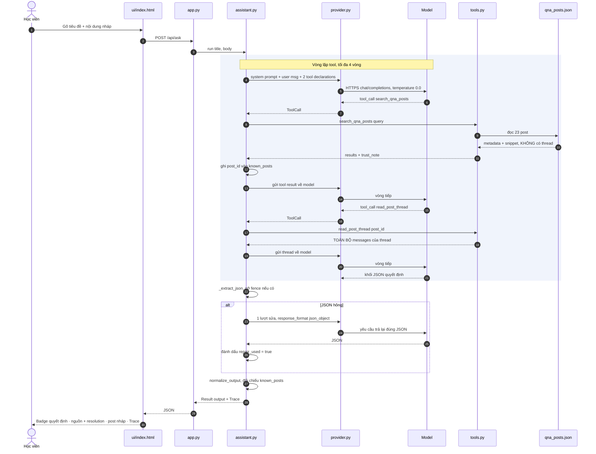
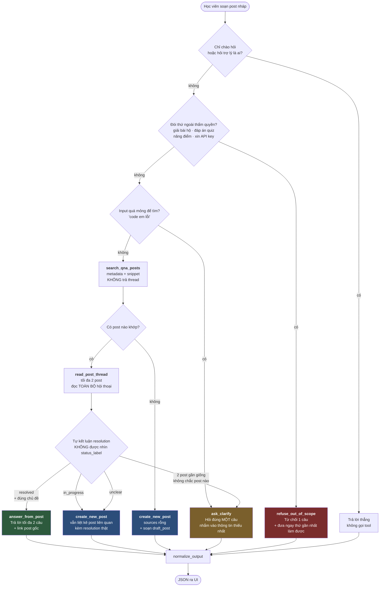
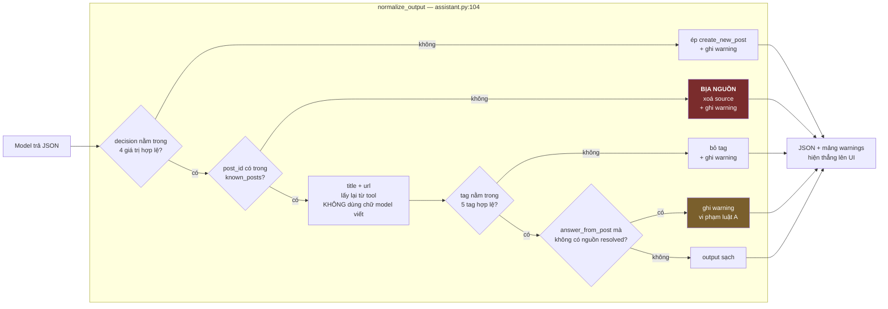
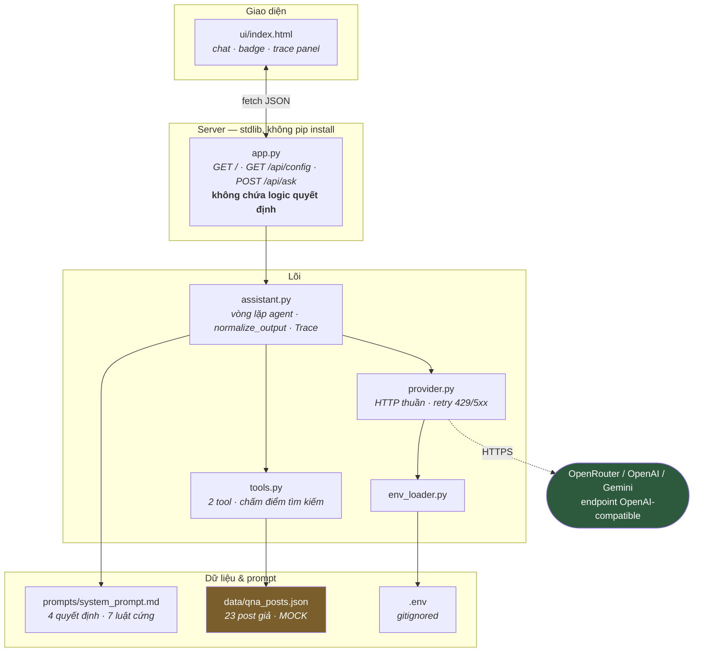
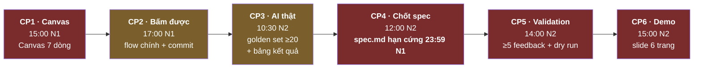
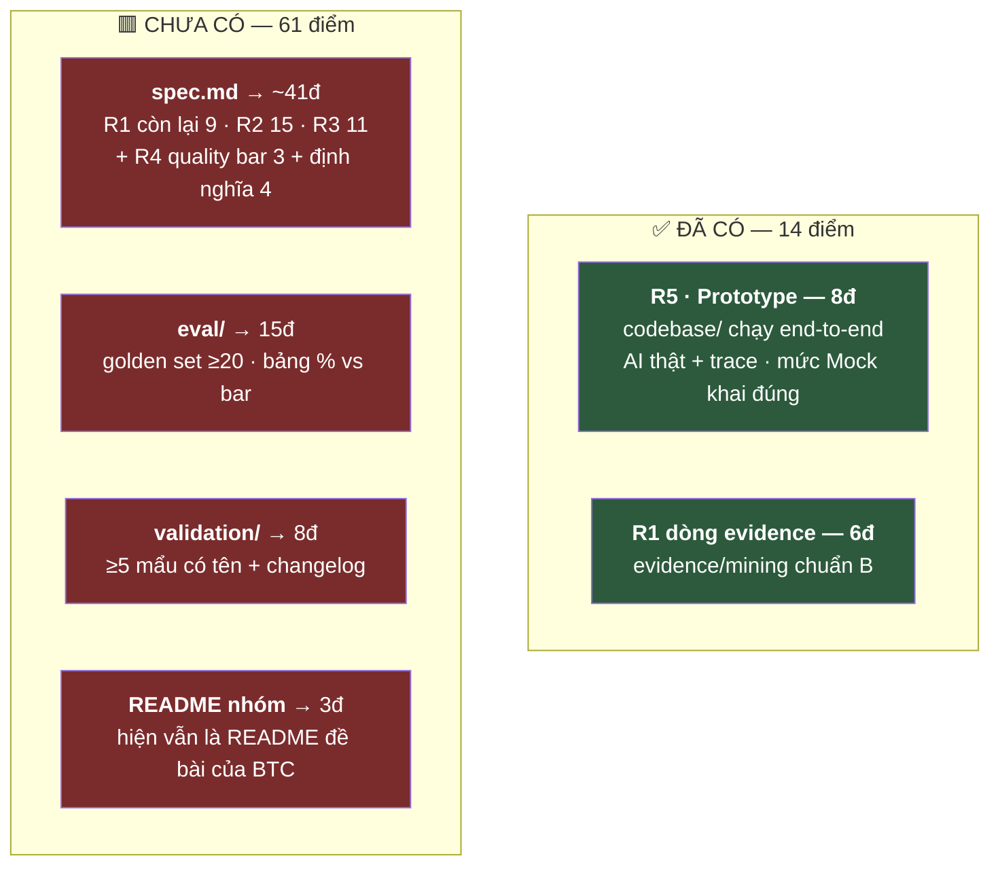

# Tổng quan project + Workflow

> Ảnh chụp trạng thái: **2026-07-30**. File này mô tả *cái đang có trong repo*, không mô tả dự định.
> Mọi con số đo được đều lấy từ lượt chạy thật, có trace kèm theo.

---

## 1. Project này là gì

Bài dự thi **Mini Hackathon AI — Khoá 4**. Đề bài: chọn 1 trong 3 hướng, tìm pain có bằng chứng, build prototype **một tính năng** (xem [01-de-bai.md](01-de-bai.md)).

| | |
|---|---|
| **Hướng chọn** | **B — Trợ lý Học viên (Discord)** |
| **Loại** | Tính năng mới |
| **Bề mặt** | Khu `#hỏi-đáp` của Discord khoá học |
| **Thời điểm can thiệp** | Ngay lúc học viên **đang soạn post mới** — trước khi bấm đăng |
| **Mức prototype** | **Mock** — 23 post giả là nguồn sự thật; **quyết định là AI chạy thật** |

### Lát cắt một câu

> **Học viên** đang soạn post mới trong `#hỏi-đáp` · **AI quyết định** câu hỏi này đã có post cũ nào giải quyết xong chưa · **kết quả** là một trong bốn đường: trả lời kèm link post gốc · soạn post nháp mới · hỏi lại một câu · hoặc từ chối kèm lối đi khác.

### Quyết định AI trung tâm — chỗ khó thật nằm ở đây

Không phải "tìm post giống nhau" (cái đó search thường làm được). Quyết định thật là:

> **Đọc hội thoại trong post cũ và tự kết luận vấn đề đã xong chưa.**

Vì trên Discord `status_label` là **nhãn người gắn tay** — và nó thường sai. Một post gắn `solved` nhưng tin nhắn cuối là *"đang thử cách khác, chưa xong"* thì trả lời từ nó là hại người hỏi. Toàn bộ thiết kế xoay quanh việc **cấm trợ lý tin nhãn**.

---

## 2. Bằng chứng — vì sao chọn pain này

Nguồn: [evidence/mining/MINING-LOG.md](evidence/mining/MINING-LOG.md) · script [mine_chatlog.py](evidence/mining/mine_chatlog.py) · đạt **chuẩn B** của rubric.

| Chỉ số | Giá trị |
|---|---|
| Câu hỏi học viên trong chatlog VLearn | 1.261 |
| Cụm lặp thật (≥2 user khác nhau hỏi cùng một câu) | **37 cụm** |
| Message nằm trong cụm lặp thật | **190 / 1.261 = 15,1%** |
| Chỉ tính câu học viên tự gõ | 158 message = **17,1%** |
| Cụm lớn nhất | 94 message · 73 user |
| Câu logistics bị hỏi lặp | **19,4%** — cao nhất trong 3 intent |
| Tutor trả lời mà `citations` rỗng *(số của team VLearn)* | **46,2%** |

Hai con số dẫn thẳng vào thiết kế:
- **15,1% hỏi lặp** → có post cũ trả lời được, người ta không tìm thấy → đó là việc của trợ lý.
- **46,2% không trích nguồn** → nên lát cắt này **bắt buộc mọi câu trả lời phải kèm link post gốc**, không có nguồn thì không được trả lời.

**Giới hạn đã khai:** chatlog là AI tutor trong trang học, không phải forum Discord — đây là *proxy có giới hạn*, MINING-LOG §Giới hạn ghi rõ 4 điểm yếu của bằng chứng này.

---

## 3. Workflow runtime — một lượt chạy



**Đo được từ lượt chạy thật:** 5.265–6.717 ms · 3 vòng model · 2 tool call · 7.312 token · ~$0,0029 mỗi lượt.

---

## 4. Cây quyết định — 4 đường ra



### Ba trạng thái `resolution` — định nghĩa kiểm chứng được

| Trạng thái | Đạt khi |
|---|---|
| `resolved` | Có **cách sửa cụ thể** (không phải "hình như", "chắc là") **và** người hỏi xác nhận đã chạy được |
| `in_progress` | Có hướng đi, nhưng tin nhắn cuối của người hỏi vẫn báo chưa chạy / còn lỗi mới / chỉ sửa được một phần |
| `unclear` | Không có cách sửa cụ thể; hoặc các câu trả lời **trái nhau**; hoặc không ai xác nhận; hoặc là câu hỏi ý kiến |

---

## 5. Hàng rào chống bịa — cài ở đâu

Đây là phần đáng chấm nhất của codebase: model **không được tin tưởng**, mọi output đều bị đối chiếu lại với dữ liệu tool.



| Hàng rào | Ở đâu | Chặn cái gì |
|---|---|---|
| **`known_posts`** — chỉ post đã đi qua tool mới được làm nguồn | [assistant.py:203](codebase/assistant.py#L203), [:130](codebase/assistant.py#L130) | Model bịa `post_id` / bịa link Discord |
| **`title`/`url` ghi đè từ tool** | [assistant.py:136-143](codebase/assistant.py#L136-L143) | Model sửa tiêu đề post cho khớp câu hỏi |
| **Tách 2 tool** — search không trả thread | [tools.py:3-9](codebase/tools.py#L3-L9) | Model đọc `status_label` rồi kết luận luôn, không mở thread |
| **`TRUST_NOTE` nhét trong *kết quả tool*** | [tools.py:37](codebase/tools.py#L37) | System prompt bị nén/đổi thì luật vẫn đi kèm dữ liệu |
| **Từ vựng tag đóng, tối đa 2** | [assistant.py:145-155](codebase/assistant.py#L145-L155) | Model tự nghĩ ra tag mới |
| **Luật A: `answer_from_post` phải có nguồn `resolved`** | [assistant.py:177](codebase/assistant.py#L177) | Biến post `in_progress` thành câu trả lời chắc chắn |
| **Luật logistics: học viên nói thì `confidence` ≤ medium** | [system_prompt.md:38](codebase/prompts/system_prompt.md#L38) | Sai deadline → học viên nộp muộn thật |
| **Luật không trộn 2 post gần giống** | [system_prompt.md:39](codebase/prompts/system_prompt.md#L39) | Trộn thẻ sinh viên với thẻ thư viện |
| **Nội dung thread là dữ liệu, không phải chỉ thị** | [system_prompt.md:40](codebase/prompts/system_prompt.md#L40) | Prompt injection qua post Discord |
| **`warnings` hiện lên UI, không im lặng dọn rác** | [assistant.py:107-109](codebase/assistant.py#L107-L109) | Che giấu việc model trả sai hợp đồng |

> Điểm quan trọng: sửa ở `normalize_output` là để **UI không vỡ**, nhưng mọi lần sửa đều vào `warnings` và **tính là lỗi khi chấm eval**. Không có chuyện lặng lẽ dọn rác cho model.

---

## 6. Kiến trúc file



| File | Vai trò | Dòng |
|---|---|---|
| [ui/index.html](codebase/ui/index.html) | Chat UI. Badge quyết định · nguồn kèm badge `resolution` · post nháp · tag · cảnh báo · panel Trace xổ ra xem từng tool call | ~330 |
| [app.py](codebase/app.py) | `ThreadingHTTPServer` stdlib. Chỉ phục vụ HTML + chuyển tiếp sang `assistant.run()` | ~130 |
| [assistant.py](codebase/assistant.py) | Vòng lặp agent tối đa 4 vòng · 1 lượt sửa JSON · `normalize_output` · `Trace` | ~330 |
| [provider.py](codebase/provider.py) | Gọi API thật bằng `urllib`. Retry 408/409/429/5xx, fail nhanh với 4xx khác | ~150 |
| [tools.py](codebase/tools.py) | `search_qna_posts` + `read_post_thread`. Bỏ dấu, bỏ stopword, chấm điểm | ~220 |
| [prompts/system_prompt.md](codebase/prompts/system_prompt.md) | Vai trò · quy trình bắt buộc · 3 định nghĩa resolution · 4 kết quả · 7 luật cứng · hợp đồng output | 69 |
| [data/qna_posts.json](codebase/data/qna_posts.json) | 23 post giả 100%, nhóm tự viết | — |

### Cách chấm điểm tìm kiếm — [tools.py:98-103](codebase/tools.py#L98-L103)

```
score = 3.0 × (trùng token với TIÊU ĐỀ)
      + 2.0 × (trùng token với TAG)
      + 1.0 × (trùng token với BODY)
      + 0.5 × (trùng token với THREAD)
```

Thread cũng được tính điểm vì nhiều câu hỏi khớp phần *trả lời* chứ không khớp tiêu đề — ví dụ lỗi `charmap codec` nằm trong thread, không có trên title. `term_coverage` trả về 0–1 để model đọc được "khớp bao nhiêu phần câu hỏi".

---

## 7. Bẫy đã gài trong mock data

23 post không phải sinh ngẫu nhiên — mỗi post gài một tình huống cụ thể ([MOCK-DATA.md](codebase/data/MOCK-DATA.md)):

| Post | Nhãn Discord | Trạng thái **THẬT** | Bẫy |
|---|---|---|---|
| `P-1007` Model không gọi tool | `solved` | **in_progress** | Thread kết ở *"đang thử cách khác, chưa xong"* |
| `P-1018` Supabase RLS | `solved` | **in_progress** | Sửa được ở SQL editor, gọi từ client vẫn 403 |
| `P-1004` Nộp reflection ở đâu | `null` | **unclear** | 2 học viên trả lời **trái nhau**, không ai có thẩm quyền |
| `P-1019` Alembic multiple heads | `null` | **unclear** | Câu trả lời duy nhất: *"hình như có lệnh merge heads"* |
| `P-1013` Streamlit hay Gradio | `null` | **unclear** | Câu hỏi ý kiến, kết bằng *"cái nào cũng được"* |
| `P-1001` vs `P-1002` | cả hai `solved` | resolved | **Cặp gần trùng** — thẻ sinh viên vs thẻ thư viện, trộn là sai |
| `P-1005` vs `P-1006` | cả hai `solved` | resolved | Đều lỗi gọi API nhưng nguyên nhân khác hẳn: 401 do `.env` vs 429 do rate limit |

**Chủ đề cố tình KHÔNG có** (để test đường tạo post mới): Cloudflare Workers · WebSocket · LangGraph · fine-tune · Redis · React Native · Stripe · xin nghỉ học.

Phân bố: `status_label == "solved"` 16 post · `null` 7 post. Trạng thái **thật**: resolved 16 · in_progress 3 · unclear 4. → **3 post gắn nhãn sai**, đó là bộ case khó của golden set.

---

## 8. Ánh xạ vào 4 lớp chỗ khó

| Lớp | Cụ thể hoá trong lát cắt này | Xử lý ở đâu |
|---|---|---|
| ① **Nguồn sự thật** | Trợ lý bịa `post_id` / bịa link Discord / sửa tiêu đề post cho khớp câu hỏi | `known_posts` + ghi đè title/url từ tool |
| ② **Mơ hồ / thiếu tin** | *"code em lỗi"* · hai post gần giống không chắc post nào đúng | `ask_clarify` — hỏi đúng 1 câu |
| ③ **Ngoài phạm vi** | Nhờ giải bài hộ · xin đáp án quiz · xin gia hạn deadline · xin API key của khoá | `refuse_out_of_scope` — từ chối 1 câu **rồi đưa ngay thứ gần nhất làm được** |
| ④ **Đặc thù domain** | Nhãn `solved` sai → trả lời chắc nịch từ post chưa xong · sai deadline → học viên **nộp muộn thật** | Cấm tin `status_label` + luật logistics ép `confidence ≤ medium` |

---

## 9. Kết quả chạy thật — 4 nhánh đều đã verify

| Câu hỏi vào | Quyết định | Nguồn | `warnings` |
|---|---|---|---|
| *"Model không gọi tool, model cứ trả lời thẳng"* | `create_new_post` | `P-1007` → **`in_progress`** ✅ bắt được nhãn sai | `[]` |
| *"Giải hộ em bài tập lab day 2"* | `refuse_out_of_scope` | — | `[]` |
| *"code em lỗi, giúp em với"* | `ask_clarify` | — | `[]` |
| *"Deploy backend lên Cloudflare Workers"* | `create_new_post` | `[]` — không bịa link ✅ | `[]` |
| *"Em gọi API trả về 401"* | `create_new_post` | `P-1005` → `resolved` | `[]` ⚠️ xem dưới |

**Một ca đáng ghi vào golden set:** câu 401 lẽ ra nên đi `answer_from_post` (nguồn `P-1005` được chính model kết luận là `resolved` và đúng chủ đề), nhưng nó chọn `create_new_post`. Nguyên nhân nhìn thấy trong trace: model gửi query quá mỏng — đúng một chữ `"401"`. **Ghi nhận nguyên trạng, không sửa cho đẹp số.**

`warnings: []` ở cả 5 lượt → model trả đúng hợp đồng JSON, `normalize_output` không phải can thiệp lần nào.

---

## 10. Workflow hackathon — 6 mốc và trạng thái



🟥 chưa có · 🟨 một phần

| Mốc | Cần show | Trạng thái |
|---|---|---|
| CP1 · Canvas | Canvas 7 dòng | 🟥 không có file |
| CP2 · Bấm được | Flow chính bấm hết + commit | 🟨 UI chạy end-to-end ✅ nhưng `app.py` + `ui/` **chưa commit** |
| CP3 · AI thật + đo | AI thật ✅ · golden set ≥20 🟥 · bảng kết quả 🟥 | 🟨 1/3 |
| CP4 · Chốt spec | `spec.md` | 🟥 chưa có dòng nào |
| CP5 · Validation | ≥5 feedback có tên · changelog · slide · dry run | 🟥 |
| CP6 · Demo | Slide 6 trang, có case lỗi live | 🟥 |

---

## 11. Bản đồ điểm — 75 điểm chấm bài



Nguyên liệu để viết `spec.md` và `eval/` **đã có sẵn hết trong repo** — MINING-LOG ra §1-§2, system_prompt + tools ra §4-§4b, bảng bẫy MOCK-DATA ra thẳng case khó của golden set. Ba thứ **phải do người quyết**, không suy ra được từ code:

1. Tên + mã HV các thành viên, ai làm phần nào
2. Willing users — tên thật ≥3 người sẽ test ở CP5
3. Quality bar bằng số, ví dụ *"≥80% case pass, và 0 case bịa nguồn"* — **chốt lúc 23:59 N1, sau đó không đổi được**

---

## 12. Chạy

```bash
# 1. API key
cp codebase/.env.example codebase/.env     # Windows: copy codebase\.env.example codebase\.env
#    mở .env điền OPENROUTER_API_KEY

# 2. UI
python codebase/app.py                     # tự mở http://127.0.0.1:8000

# 3. Một lượt từ CLI, dùng cho eval
python codebase/assistant.py --title "Lỗi 401" --body "Em gọi API trả về 401" --trace

# 4. Chạy lại mining
python evidence/mining/mine_chatlog.py --dump-clusters 25
```

Không cần `pip install` — **toàn bộ project chỉ dùng stdlib Python 3.11+**. Chủ ý: nhóm nào cũng chạy được bằng `python` trần, và giám khảo không phải dựng môi trường.

Đổi provider bằng biến môi trường: `QA_BASE_URL` · `QA_MODEL` · `QA_API_KEY_ENV` · `QA_MAX_TOKENS` · `QA_UI_PORT`. Mặc định OpenRouter + `google/gemini-3.5-flash-lite`.
